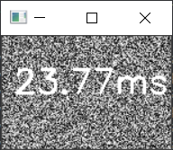

# Ping my Image
This program gets the video stream from your camera and meassures the ping of your computer to https://www.otiv.ai/ and writes it over the image and displays it

## Requirements
All the required libraries can be installed running the install_dependencies.sh file

## Launch
The program doesn't have much options so it should be enough to
```
python ping_my_image.py
```

just make sure the python you launch is the same where system's `pip` points to. 

## Behaviour
When you launch the program there are two options: 

1. Your camera is recognized, then the video stream will be shown with the respective ping on it


2. Your camera is not recognized, then a random image will be generated every half a second with the ping written on top.



## Stop program 
To stop the program just hit the 'q' button (make sure no caps lock)